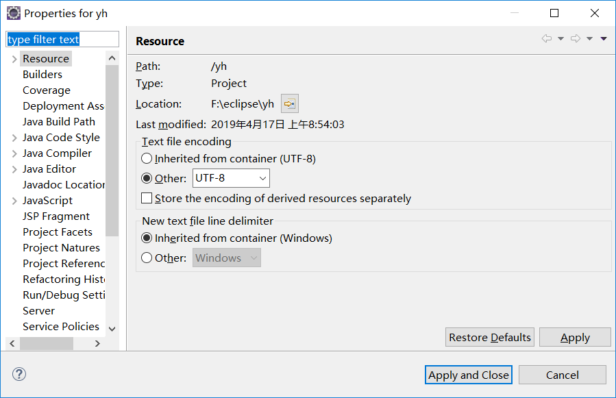

# 需求
原本服务器上tomcat部署了一个javaweb项目在80端口，这次要部署另一个javaweb项目在8090端口，或者同时部署在同一端口不同目录下。
# 解决方法
## 不同端口部署
不同端口部署我们需要修改Tomcat\conf路径下的server.xml文件，复制一下原本<Service></Service>标签里面的内容，然后修改Service_name port（你要的端口）  Engine_name Host_appBase（存放项目的文件夹） 修改后内容如下。
<!-- more -->
```xml
<?xml version='1.0' encoding='utf-8'?>

<Server port="8005" shutdown="SHUTDOWN">
  
  <Listener className="org.apache.catalina.core.AprLifecycleListener" SSLEngine="on" />
  <Listener className="org.apache.catalina.core.JasperListener" />
  <Listener className="org.apache.catalina.core.JreMemoryLeakPreventionListener" />
  <Listener className="org.apache.catalina.mbeans.GlobalResourcesLifecycleListener" />
  <Listener className="org.apache.catalina.core.ThreadLocalLeakPreventionListener" />
  <GlobalNamingResources>
    <Resource name="UserDatabase" auth="Container"
              type="org.apache.catalina.UserDatabase"
              description="User database that can be updated and saved"
              factory="org.apache.catalina.users.MemoryUserDatabaseFactory"
              pathname="conf/tomcat-users.xml" />
  </GlobalNamingResources>
  <Service name="Catalina">
    <Connector port="8080" protocol="HTTP/1.1"
               connectionTimeout="20000"
               redirectPort="8443" />
    <Connector port="8009" protocol="AJP/1.3" redirectPort="8443" />
    <Engine name="Catalina" defaultHost="localhost">
      <Realm className="org.apache.catalina.realm.LockOutRealm">
        <Realm className="org.apache.catalina.realm.UserDatabaseRealm"
               resourceName="UserDatabase"/>
      </Realm>
      <Host name="localhost"  appBase="webapps"
            unpackWARs="true" autoDeploy="true">
        <Valve className="org.apache.catalina.valves.AccessLogValve" directory="logs"
               prefix="localhost_access_log." suffix=".txt"
               pattern="%h %l %u %t &quot;%r&quot; %s %b" />
      </Host>
    </Engine>
  </Service>
    <Service name="Catalina2">
    <Connector port="8090" protocol="HTTP/1.1"
               connectionTimeout="20000"
               redirectPort="8443" />
    <Connector port="8009" protocol="AJP/1.3" redirectPort="8443" />
    <Engine name="Catalina2" defaultHost="localhost">
      <Realm className="org.apache.catalina.realm.LockOutRealm">
        <Realm className="org.apache.catalina.realm.UserDatabaseRealm"
               resourceName="UserDatabase"/>
      </Realm>
      <Host name="localhost"  appBase="webapps2"
            unpackWARs="true" autoDeploy="true">
        <Valve className="org.apache.catalina.valves.AccessLogValve" directory="logs"
               prefix="localhost_access_log." suffix=".txt"
               pattern="%h %l %u %t &quot;%r&quot; %s %b" />
      </Host>
    </Engine>
  </Service>
</Server>
```
然后复制一份Tomcat目录下的webapps目录修改名字为你上面修改的appBase的值，同理复制一份Tomcat\conf目录下的catalina文件改名为上面修改的name的值，然后把javaweb项目放入webapps2（appBase值）中，重启Tomcat即可，Tomcat版本的差异会导致路径下的文件不同，安装版本和解压版本也会有所不同，我用的是安装版的Tomcat7。
## 同一端口不同路径部署
同一端口部署就相对简单了，只需要把javaweb项目导出的.war文件放入Tomcat路径下的webapps下重启Tomcat即可。
## 默认访问
更改上文中的server.xml文件，在Host标签中加入Context path="" docBase="你的项目的绝对路径"即可,示例如下。
```xml
      <Host name="localhost"  appBase="webapps"
            unpackWARs="true" autoDeploy="true">
        <Valve className="org.apache.catalina.valves.AccessLogValve" directory="logs"
               prefix="localhost_access_log." suffix=".txt"
               pattern="%h %l %u %t &quot;%r&quot; %s %b" />
        <Context path="" docBase="C:\Tomcat\webapps\dwsurvey" />
      </Host>
```
# 遇到的问题
## 乱码
部署成功之后访问页面发现页面中文乱码，大概可能是三个方面出现问题，若果不能确定的话可以挨个修改排查。
### 工程编码
修改eclipse项目的编码为UTF-8

### Tomcat编码
修改server.xml中的 Connector标签，增加属性URIEncoding="UTF-8"，示例如下。
```xml
 <Connector executor="tomcatThreadPool"
               port="80" protocol="HTTP/1.1"
               connectionTimeout="20000" URIEncoding="UTF-8"
               redirectPort="8443" />
```
### 数据库编码
我用的是Mysql，删除掉之前导入的数据库（drop databse “数据库名”）执行以下命令重新创建数据库
```
CREATE DATABASE `mydatabase` DEFAULT CHARACTER SET utf8 COLLATE utf8_general_ci;
```
然后用source命令重新导入数据库，登陆之后先用use命令选择数据库，然后source sql文件的绝对路径就能成功导入了。
## 内存泄露
成功启动Tomcat访问项目的时候，Tomcat卡死，查看Tomcat\logs文件下的日志发现错误
```
Exception in thread "http-bio-8090-exec-8" java.lang.OutOfMemoryError: PermGen space，
```
查询得知是因为JVM内存大小设置不当，加大即可。   
免安装版本的Tomcat可以修改Tomcat\bin目录下的catalina.bat文件在“echo "Using CATALINA_BASE: $CATALINA_BASE"”（大概在130+行）上面加入以下行： JAVA_OPTS="-server -Xms800m -Xmx800m -XX:MaxNewSize=256m" 。
安装版本bin目录下没有catalina.bat文件所以修改注册表Win+R 输入regedit打开注册表  。
32位OS打开HKEY_LOCAL_MACHINE -> SOFTWARE -> Apache Software Fundation -> Procrun2.0 -> Tomcat7 -> Parameters -> Java -> Options   
64位OS打开HKEY_LOCAL_MACHINE -> SOFTWARE -> WOw6432Node -> Apache Software Fundation -> Procrun2.0 -> Tomcat7 -> Parameters -> Java -> Option  
在最后加上：
-XX:PermSize=128m
-XX:MaxPermSize=512m

## 无法打开文件
项目运行报错，找不到数据库表，经过老师帮助查看日志发现一个路径很长的XLS文件无法打开，此文件是配置数据库映射关系的，怀疑是路径过深的问题，安装Tomcat到C盘根目录解决。
 ~~这样好暴力啊~~
## IIS占用80端口
因为用的是Windows Server所以自带了IIS，考虑到之后可能会用到IIS，所以不彻底删除，只是禁用在管理员命令行运行iisreset/stop，服务里禁用 world wide web publishing service（IIS）就行了，或者改变IIS的端口，这个错误耽搁了好久，因为浏览器的缓存，导致我改好了还是会显示IIS页面，浏览器缓存害死人啊。
## JDK环境变量
之前的项目用的是1.8，但是现在部署的项目必须是1.7，因为之前没有经验天真的以为把这俩都设置成环境变量就万事大吉了，结果1.7的项目报错，经查询原因是因为JDK版本，测试之后发现在1.7环境下之前的项目依然可以运行。所以删除1.8环境变量，cmd java -version 结果还是1.8，~~当时我仿佛见了鬼~~，气得我删除了1.8，然后继续java -version，结果输出找不到1.8，~~找不到你还找个头！~~ 又查了一圈，说是可能写入了注册表，操作了一番发现并不是。最后我只好使出绝招 where java，然后在某Oracle路径下发现了一系列以java.exe为首的文件，一看环境变量，原来Oracle目录在环境变量里，但是有这个java.exe为什么会显示找不到呢，百度之后发现原来这个java.exe是一个链接文件相当于一个快捷方式，我把本体删了他自然就找不到了，删除这几个文件再次java -version 成功！
# 总结
这次部署耗费了我一天的时间，总结起来的错误看起来不难解决，但是遇到的时候还是要到处查，尤其是浏览器缓存已经吃过很多次亏了，总结错误就会更加熟练。~~你怎么这么熟练啊.jpg~~  
虽然部署的问题解决了，项目的问题还是不断。
